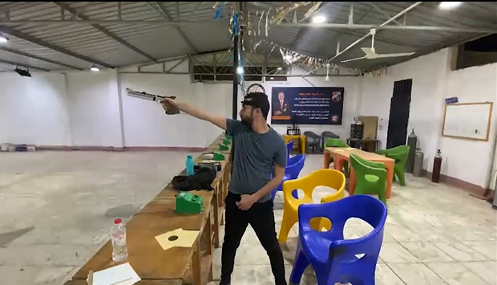
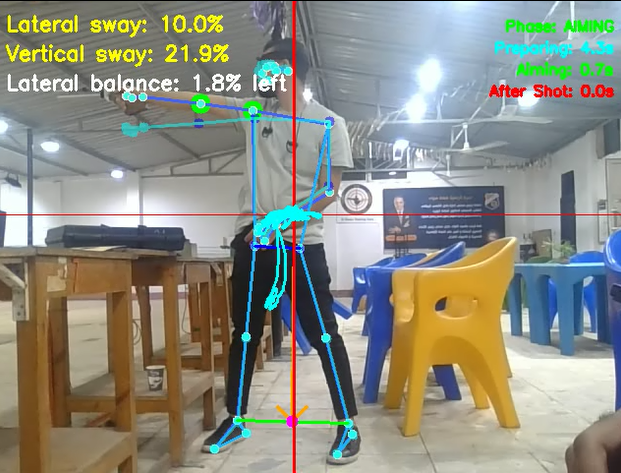

# A Pose-based Multimodal Visual Analytics Framework for 10-Meter Air Pistol Shooting

**Author:** Abdalrhman Abdullah  
**Institution:** Bauhaus-Universität Weimar, Faculty of Media  
**Degree:** Master of Science in Human-Computer Interaction (HCI)  
**Date:** September 2025

---

## 📸 Project Insights (Before & After)

This framework transforms raw video and audio data into actionable coaching insights.

| Raw Input (Webcam) | Pose Analysis & Visual Analytics |
| :--- | :--- |
|  |  |
| *Raw video feed from a standard laptop webcam.* | *Extracted skeletons, shot phase segmentation, and performance charts.* |

---

## 🎯 Project Overview

This project presents a laptop-deployable visual-analytics system designed for the **Olympic 10-meter air pistol shooting** discipline. Unlike expensive specialized hardware, this system uses a standard webcam and microphone to provide high-level diagnostic data for coaches and athletes.

The system automatically:
1. **Detects shot events** using audio-signal processing.
2. **Extracts 2D pose skeletons** in real-time.
3. **Segments shots** into functional phases: *UP, PREPARING, AIMING, and AFTER SHOT*.
4. **Visualizes performance** metrics (tempo, stability, score) in an interactive dashboard.

---

## ✨ Key Features

* **Multimodal Shot Detection:** Uses **RMS-based audio anchoring** to pinpoint the exact millisecond a shot is fired.
* **Automatic Phase Segmentation:** Intelligent tracking of the pistol's movement to divide the shooting process into four distinct phases.
* **Interactive Dashboards:**
    * **Small-Multiple Line Charts:** Detect fatigue or warm-up patterns across a session.
    * **Stacked Bar Charts:** Analyze time distribution for every shot.
    * **Dual-Skeleton Mode:** Compare two different shots side-by-side to find inconsistencies in posture.
    * **Virtual Target Overlay:** See shot groupings and stability patterns on a digital target.
* **HCI-Optimized Design:** Built with a focus on reducing cognitive load for coaches, featuring coordinated views and intuitive filtering.

---

## 🛠 Tech Stack

* **Language:** Python
* **Computer Vision:** MediaPipe Pose (Skeleton extraction), Ultralytics YOLO (Target detection)
* **Audio Processing:** PyAudio / audioop (Shot anchoring)
* **GUI Framework:** PyQt5
* **Data Analysis:** Plotly, Pandas, NumPy
* **Storage:** JSON (Pose Metadata) & CSV (Session Statistics)

---

## 📋 System Pipeline

The application operates using three synchronized threads to ensure smooth performance:
1.  **Pose Thread:** Handles the real-time extraction of 33 body landmarks via MediaPipe.
2.  **Audio Thread:** Monitors the environment for the high-frequency sound of the air pistol.
3.  **Analysis Thread:** Verifies data, segments the phases, and updates the interactive visualizations.

---

## 🚀 How to Use (Preview)

1. **Setup:** Position your laptop webcam to capture the shooter's profile.
2. **Calibration:** The system automatically detects the target and the shooter's initial pose.
3. **Session:** Start shooting. The system will log every shot automatically via the microphone.
4. **Analysis:** Review the dashboard to identify why certain shots scored lower based on posture and timing.

---

## 📖 Citation

If you use this framework or the findings from the thesis for your research, please cite:

```text
Abdalrhman Abdullah (2025). A Pose-based Multimodal Visual Analytics Framework 
for Performance Modelling and Coaching in Olympic 10-Meter Air Pistol Shooting. 
Master's Thesis. Bauhaus-Universität Weimar.
